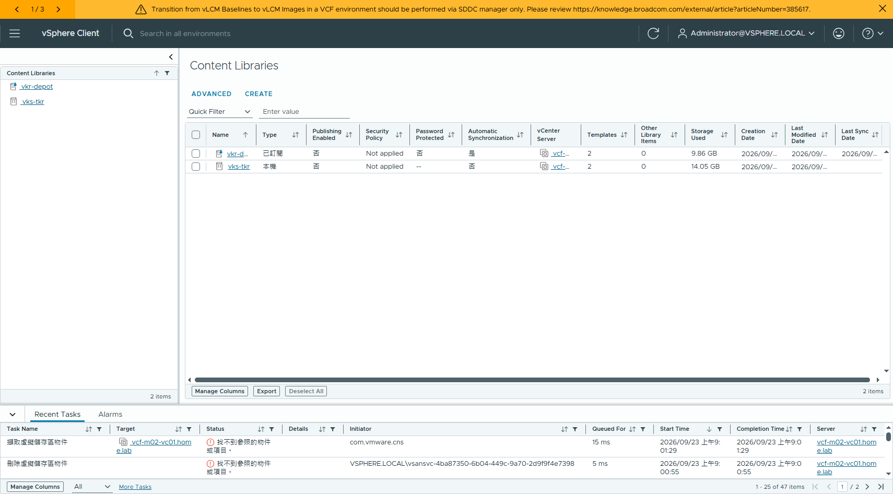
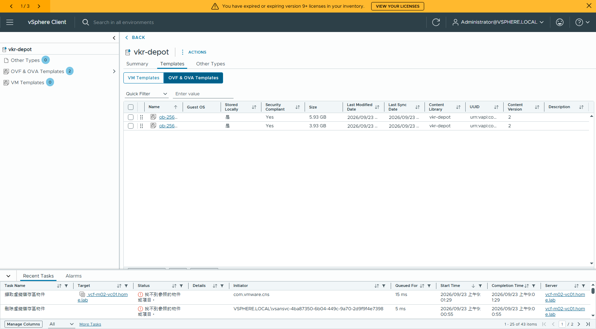
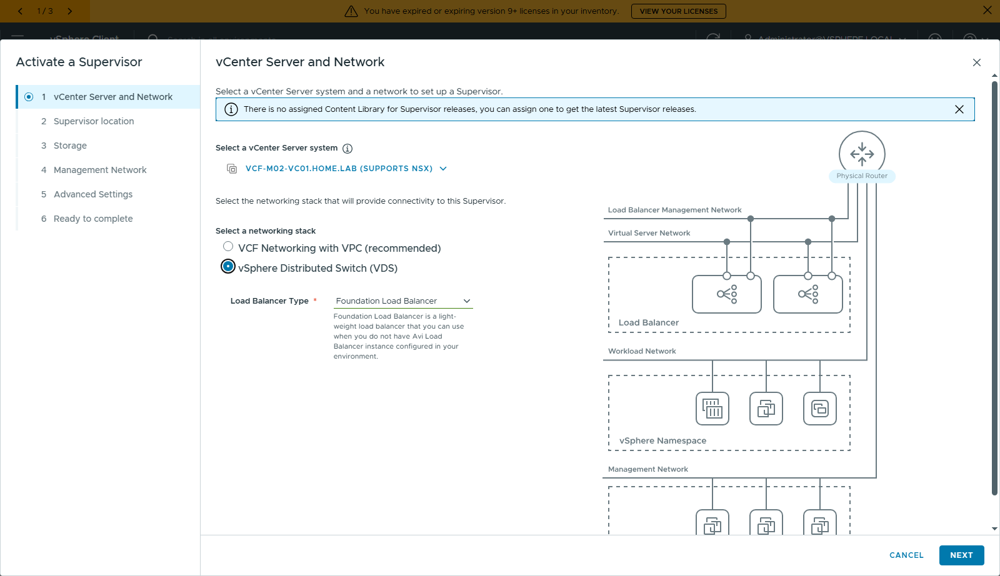
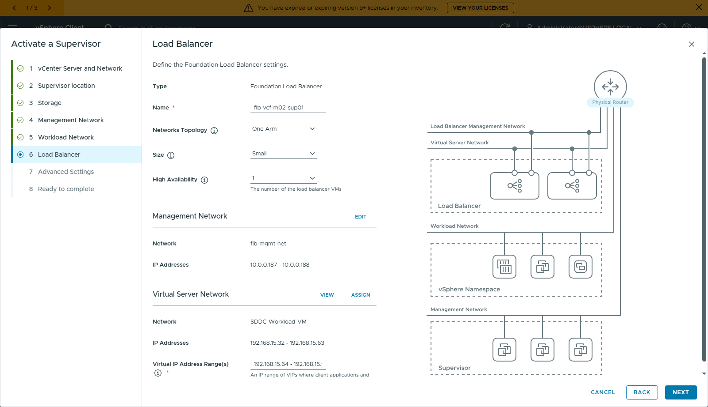
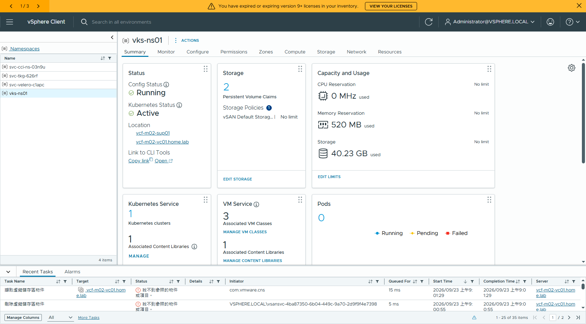
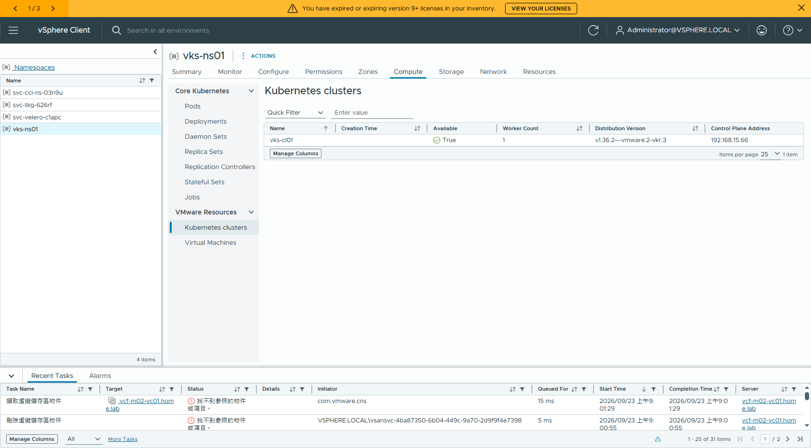

# VCF 9.1.1 air-gap:Supervisor + VKS 部署實作(VDS + Foundation Load Balancer)

> ✅ **2026-09-22 ~ 09-23 nested lab 端到端實測通過**
> Supervisor `RUNNING`/`READY` → VKS guest cluster `v1.36.2+vmware.2` → cert-manager 1.20.2 從**自建 Software Depot** 安裝完成,guest cluster 全程無外網。
>
> 完整圖文版:[`VCF911-VKS-AirGap-StepByStep.docx`](VCF911-VKS-AirGap-StepByStep.docx)(23 頁 / 13 張 UI 截圖)
> 依據官方:[vmware/vsphere-supervisor → airgapped/air-gapped-vcf91.md](https://github.com/vmware/vsphere-supervisor/blob/main/airgapped/air-gapped-vcf91.md)
>
> 舊版(9.1.0 / TKr / 手動 CL)請看 [`../airgap/vks-airgap-runbook.md`](../airgap/vks-airgap-runbook.md)。

## 與官方文件的差異

| 項目 | 官方 air-gapped-vcf91.md | 本文 |
|---|---|---|
| VKr 來源 | `wp-content.broadcom.com/v2/latest/`,Bastion 下載後手動上傳 CL | 用 **depot token** 鏡像進自建 depot,再以**訂閱式 CL** 自動同步 |
| Supervisor 映像庫 | 建議指派 Content Library | 9.1.1 vCenter **已內建** wcpagent + spherelet,不需指派 |
| OCI registry | VCF Software Depot 內建(9.1 起) | 相同(`https://<fleet-fqdn>/v2/`) |
| CLI | VCF CLI(`vcf context` / `vcf addon`) | `kubectl-vsphere` + Carvel CR(VCF CLI 要 portal 下載) |
| LB | 未指定 | **Foundation Load Balancer**(不使用 Avi) |

---

## Step 1 — 取得 VKr

官方下載點(公開、免 token,本身就是 content library 訂閱 URL):

```
https://wp-content.broadcom.com/v2/latest/
```

實測列出 138 個 item / k8s v1.16.8 ~ v1.36.2 共 70 個版本。

另一條路(本文採用):VCF product version catalog 裡的 `VKR` 元件,**depot token 就能抓**:

```bash
pwsh My-VcfDepot.v3.ps1 -TokenFile token.txt -Component VKR -Summary
#   Components: 1   Files: 1006   Total: 750.38 GB
```

> 🔴 **檔名陷阱**:舊版 VKr 用通用檔名 `photon-ova.ovf` / `photon-ova-disk1.vmdk`,
> 新版(1.35.6、1.36.x)才是帶版本的 `photon-5-amd64-v1.36.2---vmware.2-vkr.3.ovf`。
> 一律從 catalog 的 `binaries[].fileName` 取 —— `dl.broadcom.com` 對**不存在的路徑回 403(不是 404)**,
> 拼錯檔名會被誤判成「沒有授權」。

以正確檔名實測 36 個 photon 版本,token 可下載的是「每條支援線最新 patch + VCF 隨附版」:

| k8s | 說明 |
|---|---|
| `v1.36.2+vmware.2-vkr.3` | 最新(本文使用) |
| `v1.35.6+vmware.2-vkr.3` | 1.35 線最新 |
| `v1.34.9+vmware.2-vkr.4` | 1.34 線最新 |
| `v1.34.2+vmware.2-vkr.2` | VCF 9.1.0 隨附版 |
| `v1.33.13+vmware.2-fips-vkr.4` | 1.33 線最新 |

更舊的版本走 `wp-content`。`vcf-download-tool artifacts`(`--component VKR` / `VKS_STANDARD_PACKAGES`)也能抓,
但**只接受 activation code**(`binaries` 才吃 token)。

## Step 2 — 鏡像進自建 Software Depot

```bash
./scripts/mirror-vkr-to-depot.sh /root/token.txt /depot \
    "photon-5-amd64-v1.36.2" "photon-5-amd64-v1.35.6"
# → /depot/PROD/COMP/VKR/ob-25650988-...  /  ob-25653794-...   (5.9 GB,逐檔比對 sha256)
```

產生訂閱用的 metadata(讓 depot 變成 content library 來源):

```bash
curl -s https://wp-content.broadcom.com/v2/latest/items.json -o wp-items.json
python scripts/make-vkr-subscription.py wp-items.json /depot/PROD/COMP/VKR \
    ob-25650988-photon-5-amd64-v1.36.2---vmware.2-vkr.3 \
    ob-25653794-photon-5-amd64-v1.35.6---vmware.2-vkr.3
curl -s -o /dev/null -w '%{http_code}\n' http://<depot>:8888/PROD/COMP/VKR/lib.json   # 200
```

## Step 3 — 建立 Content Library

```bash
# 訂閱式(指向自建 depot,新版自動同步)
govc library.create -sub http://<depot>:8888/PROD/COMP/VKR/lib.json \
     -sub-autosync=true -sub-ondemand=false -ds <datastore> vkr-depot

# 或 Local(手動上傳)
govc library.create -ds <datastore> vks-tkr
govc library.import -n <item-name> vks-tkr 'E:\path\photon-ova.ovf'
```

> 🔑 **KubernetesRelease(kr)只有舊 API 指派 CL 才會生成**:
> ```
> PATCH /api/vcenter/namespace-management/clusters/{cluster}
> {"default_kubernetes_service_content_library":"<libId>"}
> ```
> 只做新的 `PATCH supervisors/{id}/workloads/images/settings` → 映像進得來,但 `kr`/`osimage` 永遠是空的,
> 建 cluster 會被 webhook 擋 `Missing compatible KR/OSImage`。




## Step 4 — 啟用 Supervisor(VDS + Foundation LB)

vSphere Client → 選單 → **Supervisor Management** → **GET STARTED**(8 步)
路由:`/ui/app/workload-platform/vsphere-network-introduction`(舊的 `workload-management` 在 9.1.1 已不存在)

| 步驟 | 設定 |
|---|---|
| 1 | 網路堆疊 **vSphere Distributed Switch (VDS)** + Load Balancer Type **Foundation Load Balancer** |
| 2 | CLUSTER DEPLOYMENT 分頁;Supervisor 名稱;CP HA 視資源 |
| 3 | 三個 storage policy(Control Plane / Ephemeral / Image Cache) |
| 4 | 管理網路 Static:IP range、mask、gw、DNS、search domain、NTP |
| 5 | Workload 網路:獨立 VLAN 的 port group、K8s Service 網段、IP range、gw |
| 6 | FLB:One Arm / Small / HA;**管理網路名稱要與 Supervisor 管理網路不同名**;VIP range |
| 7 | Control Plane Size |
| 8 | Ready to complete → FINISH(約 27 分鐘 RUNNING) |




> 🔴 **FINISH 被擋 `名稱 ... 必須符合 RFC-1123`**:workload 的 Network Name 會自動帶入 port group 名稱,
> 含大寫就過不了 → 改成全小寫(port group 本身不用改名)。

### 主機節點卡在 Configuring(0/12)

`kubectl get nodes` 只有 control plane VM、主機 `esxcli software vib list | grep spherelet` 是 0 →
spherelet 的 vLCM solution(`com.vmware.vsphere-wcp`)remediation 被 **vSAN 健康檢查**擋住:

```
POST /api/esx/settings/clusters/{c}/software?action=apply → FAILED
     Health Check for '<esxi>' failed (com.vmware.vcIntegrity.lifecycle.TaskError.HealthCheckFailed)
```

nested lab 解法:把非 green 的檢查靜音後重跑 apply,約 4 分鐘完成。

```powershell
$hs.VsanHealthSetVsanClusterSilentChecks($cl.ExtensionData.MoRef,
    @("nvmeonhcl","perfsvcstatus","vsanenablesupportinsight"), $null)
```

## Step 5 — 建立 vSphere Namespace

```bash
POST /api/vcenter/namespaces/instances/v2
{
  "supervisor": "<supervisor-id>",          # 注意:不是 "cluster"
  "namespace": "vks-ns01",
  "storage_specs": [ { "policy": "<storage policy id>" } ],
  "vm_service_spec": {
    "content_libraries": [ "<library id>" ],
    "vm_classes": [ "best-effort-small", "best-effort-medium", "guaranteed-small" ]
  }
}
```



## Step 6 — 開啟 Software Depot 的 OCI 上傳

VCF 9.1 的 Software Depot 內建 OCI registry(`https://<fleet-fqdn>/v2/`),**預設唯讀**,直接 push 會拿到:

```
imgpkg: Error: POST https://<fleet>/v2/.../blobs/uploads/: unexpected status code 405 Method Not Allowed
```

用官方腳本打開(需要 VSP FQDN 與 VSP admin 帳密):

```bash
./toggle_software_depot_oci_image_upload.sh enable \
    --vsp-host <vsp-fqdn> --admin-username admin --admin-password '<password>'
# 內部:POST /api/v1/identity/token (x-www-form-urlencoded, grant_type=password)
#       → components 裡找 vcf-fleet-depot → POST components/{id}?action=apply
#         {"spec":{"configuration":{"oci":{"offlineWriteEnabled":true}}}}
```

> ⚠ 官方要求**上傳完成後再跑一次 `disable`** —— 這個上傳通道沒有認證。
> ⚠ Git-Bash 執行時**不要**設 `MSYS_NO_PATHCONV=1`,否則 curl 讀不到 `/tmp` 的 payload 檔。

## Step 7 — 搬移 VKS Standard Packages 的 OCI 映像

版本直接問 guest cluster(內建的 PackageRepository 在 air-gap 會 timeout,錯誤訊息就寫著來源與版本):

```bash
kubectl get pkgr -n vmware-system-tkg
#   vks-addons-3.7.0-20260618   Reconcile failed: ... dial tcp 52.37.255.221:443: i/o timeout
```

```bash
./scripts/migrate-vks-addons.sh 3.7.0-20260618 <fleet-fqdn>
# → <fleet>/vks-standard-packages/ga/3.7.0-20260618/vks-addons
# → curl -sk https://<fleet>/v2/_catalog
#   {"repositories":["vks-standard-packages/ga/3.7.0-20260618/vks-addons"]}
```

## Step 8 — 部署 VKS guest cluster

```bash
curl -sk https://<supervisor-api>/wcp/plugin/windows-amd64/vsphere-plugin.zip -o vsphere-plugin.zip
KUBECTL_VSPHERE_PASSWORD=<pw> kubectl-vsphere login --server=<supervisor-api> \
    --insecure-skip-tls-verify --vsphere-username administrator@vsphere.local
kubectl apply -f specs/vks-cluster01.yaml
```

重點([`specs/vks-cluster01.yaml`](specs/vks-cluster01.yaml)):

* `cluster.x-k8s.io/v1beta2` 用 **`topology.classRef.name`**(不是 `class`)
* `version` 要對得上 Kubernetes Service 版本:
  `GET /api/vcenter/namespace-management/supervisor-services/tkg.vsphere.vmware.com/versions` → `3.7.0-embedded+v1.36`
  → 舊 VKr(如 1.32.7)的 KR 會是 `Ready=False / Compatible=False`(label `incompatible`),1.36.x 才 True/True
* ClusterClass 指定 `builtin-generic-v3.x`,套用時會自動升到最新相容版本



## Step 9 — 在 guest cluster 安裝 add-on

### 9.1 信任 depot 憑證(VMCA 簽發)

```bash
curl -sk https://<vc>/certs/download.zip -o vc-certs.zip     # 取 certs/lin/<hash>.0
kubectl patch cluster <cluster> -n <ns> --type=json --patch-file=patch-trust.json
```

`patch-trust.json` 新增一個變數:

```json
[{"op":"add","path":"/spec/topology/variables/-","value":{
  "name":"osConfiguration",
  "value":{"trust":{"additionalTrustedCAs":[{"caCert":{"content":"-----BEGIN CERTIFICATE-----..."}}]}}}}]
```

> 🔴 要用 **JSON patch 增量加**。整份 `kubectl apply` 會掉 webhook 自動加的 `bootstrapAddons`,
> 被擋 `failed to get CNI addon name from bootstrapAddons cluster variable`。會觸發節點滾動更新。

### 9.2 PackageRepository 指到自建 depot

```bash
kubectl patch pkgr vks-addons-3.7.0-20260618 -n vmware-system-tkg --type=merge -p \
  '{"spec":{"fetch":{"imgpkgBundle":{"image":"<fleet>/vks-standard-packages/ga/3.7.0-20260618/vks-addons:3.7.0-20260618"}}}}'
kubectl apply -f specs/vks-addons-repo-global.yaml     # tkg-system 也放一份
```

> 🔑 kapp-controller 的 `packaging-global-namespace` 是 **`tkg-system`**,但內建 repository 把 Package 裝在
> `vmware-system-tkg` → 別的 namespace 看不到,PackageInstall 會報 `Package ... not found`。
> 在 `tkg-system` 另建一個指向同一個 bundle 的 PackageRepository 即可全叢集可見。

### 9.3 安裝 cert-manager

```bash
kubectl apply -f specs/cert-manager-install.yaml
kubectl get pkgi -n vks-addons
#   cert-manager   1.20.2+vmware.1-vks.1   Reconcile succeeded
kubectl get pods -n cert-manager
#   cert-manager / cainjector / webhook   1/1 Running
```

官方 VCF CLI 等價指令:

```bash
vcf context create supervisor1 --endpoint https://<supervisor-api> --username administrator@vsphere.local --type k8s
vcf context use supervisor1:<ns>:<cluster>
vcf addon install cert-manager --addon-release-name cert-manager.kubernetes.vmware.com.1.20.2-vmware.1-vks.1 \
    --namespace <ns> --cluster-name <cluster>
```

---

## 踩坑速查

| # | 症狀 | 原因 / 處置 |
|---|---|---|
| 1 | `dl.broadcom.com` 回 403 | 路徑不存在也回 403(不是 404)→ 檔名一律讀 catalog 的 `fileName` |
| 2 | `vcf-download-tool artifacts` 失敗 | `artifacts` 只吃 activation code(`binaries` 才吃 token) |
| 3 | 建 cluster 被擋 `Missing compatible KR/OSImage` | KR/OSImage 只有舊 API `default_kubernetes_service_content_library` 會生成 |
| 4 | KR `Ready=False / Compatible=False` | VKr 版本與 Kubernetes Service 版本不合 |
| 5 | imgpkg push 回 405 | Software Depot OCI registry 預設唯讀 → 跑 toggle 腳本 enable |
| 6 | Supervisor 精靈 FINISH 擋 RFC-1123 | workload Network Name 帶到大寫 → 改小寫 |
| 7 | Host Config Status 卡 Configuring 0/12 | spherelet 的 vLCM remediation 被 vSAN 健康檢查擋 → 靜音非 green 檢查 |
| 8 | PackageInstall `Package not found` | global namespace 是 `tkg-system`,內建 repo 裝在 `vmware-system-tkg` |
| 9 | `kubectl apply` cluster.yaml 被 webhook 擋 | 會掉 `bootstrapAddons` → 改用 JSON patch |
| 10 | toggle 腳本 curl 讀不到檔 | Git-Bash 下不要設 `MSYS_NO_PATHCONV=1` |

---

## 附:沒有 govc 怎麼做(govc ↔ PowerCLI ↔ UI ↔ REST 對照)

本文指令以 `govc` 示範,但客戶現場常常沒有。以下是等價做法 —— **PowerCLI 與 vSphere Client UI 不需要額外安裝任何東西**。

### 先決:連線方式

```powershell
# PowerCLI
Connect-VIServer <vc> -User administrator@vsphere.local -Password '<pw>'
```

```bash
# REST(vSphere Automation API)— 取得 session token
S=$(curl -sk -X POST -u 'administrator@vsphere.local:<pw>' https://<vc>/api/session | tr -d '"')
H="vmware-api-session-id: $S"
```

```bash
# govc(單檔 exe,靠環境變數)
export GOVC_URL='https://<vc>' GOVC_USERNAME='administrator@vsphere.local' \
       GOVC_PASSWORD='<pw>' GOVC_INSECURE=1
export MSYS_NO_PATHCONV=1          # Git-Bash 必加,否則 inventory 路徑會被轉成 C:\...
```

### 對照表

| 動作 | govc | PowerCLI | vSphere Client UI | REST |
|---|---|---|---|---|
| 建**訂閱式** CL | `library.create -sub <lib.json> -sub-autosync=true -ds <ds> <name>` | `New-ContentLibrary -Name <n> -Datastore <ds> -SubscriptionUrl <url> -AutomaticSync -DownloadContentOnDemand:$false` | Content Libraries → CREATE → Subscribed | `POST /api/content/subscribed-library` |
| 建**本機** CL | `library.create -ds <ds> <name>` | `New-ContentLibrary -Name <n> -Datastore <ds>` | Content Libraries → CREATE → Local | `POST /api/content/local-library` |
| 匯入 OVF | `library.import -n <item> <lib> 'E:\path\x.ovf'` | `New-ContentLibraryItem -ContentLibrary <lib> -Name <item> -ItemType ovf -Files 'E:\path\x.ovf'` | 進 CL → ACTIONS → **Import Item**(**.ovf + .vmdk + .mf + .cert 要一起選**) | 四步:建 item → 開 update-session → 逐檔 add+PUT → complete |
| 列 CL / item | `library.ls` / `library.ls '/<lib>/*'` | `Get-ContentLibrary` / `Get-ContentLibraryItem` | Content Libraries 清單 | `GET /api/content/local-library`、`GET /api/content/library/item?library_id=<id>` |
| 指派 K8s 映像庫 | **無對應** | **無對應** | Supervisor → Configure → Kubernetes Services → Content Library → EDIT | `PATCH /api/vcenter/namespace-management/clusters/{c}`<br>`{"default_kubernetes_service_content_library":"<libId>"}` |
| 建 workload port group | `dvs.portgroup.add -dvs <vds> -type earlyBinding -nports 128 -vlan 5 <name>` | `New-VDPortgroup -VDSwitch <vds> -Name <n> -VlanId 5 -NumPorts 128` | Networking → VDS → ACTIONS → Distributed Port Group → New | `CreateDVPortgroup_Task`(SOAP) |
| 開 promiscuous / forged / MAC | 繁瑣(`object.method`) | `ReconfigureDVPortgroup_Task` + `DVSSecurityPolicy` | dvPortgroup → Edit → Security(三項都 Accept) | SOAP |
| 主機 esxcli | `host.esxcli -host.ip <ip> <cmd>` | `(Get-EsxCli -VMHost <h> -V2).<ns>.<cmd>.Invoke()` | ESXi Shell / SSH | SOAP |
| VM 內執行指令 | `guest.run -vm <vm> -- <cmd>` | `Invoke-VMScript -VM <vm> -ScriptText '<cmd>'` | — | Guest Operations API |
| 建 vSphere Namespace | **無對應** | **無對應** | Supervisor Management → Namespaces → CREATE NAMESPACE | `POST /api/vcenter/namespaces/instances/v2` |
| vLCM remediate(裝 spherelet) | **無對應** | vLCM cmdlet(有限) | Cluster → Updates → Image → REMEDIATE ALL | `POST /api/esx/settings/clusters/{c}/software?action=apply&vmw-task=true` |
| guest cluster / addon | **無對應** | **無對應** | Supervisor Management(檢視為主) | `kubectl`(Cluster / PackageRepository / PackageInstall CR) |

### REST 實例(本 lab 實測回應格式)

```bash
# 建訂閱式 CL —— datastore_id 用 moref
curl -sk -X POST -H "$H" -H 'Content-Type: application/json' \
  https://<vc>/api/content/subscribed-library -d '{
    "name": "vkr-depot",
    "type": "SUBSCRIBED",
    "storage_backings": [ { "type": "DATASTORE", "datastore_id": "datastore-15" } ],
    "subscription_info": {
      "subscription_url": "http://<depot>:8888/PROD/COMP/VKR/lib.json",
      "authentication_method": "NONE",
      "automatic_sync_enabled": true,
      "on_demand": false } }'

# 查 moref
curl -sk -H "$H" https://<vc>/api/vcenter/datastore | jq -r '.[]|"\(.datastore)  \(.name)"'
#   datastore-15  m01-cl01-ds-vsan01
curl -sk -H "$H" https://<vc>/api/vcenter/cluster   | jq -r '.[]|"\(.cluster)  \(.name)"'
#   domain-c9  m01-cl01
```

> **現場沒有 govc 的建議組合**:CL 建立與 OVF 匯入用 **PowerCLI**(一行完成,REST 要四步);
> Supervisor / Namespace / 映像庫指派這些**本來就沒有 govc 對應**的動作用 **UI 或 REST**;
> guest cluster 與 add-on 一律 **kubectl**。

## 目錄

| 路徑 | 內容 |
|---|---|
| `VCF911-VKS-AirGap-StepByStep.docx` | 完整圖文手冊(23 頁 13 圖) |
| `scripts/mirror-vkr-to-depot.sh` | VKr 鏡像進 depot(token-only) |
| `scripts/make-vkr-subscription.py` | 產生 `lib.json` / `items.json` 讓 depot 可被訂閱 |
| `scripts/migrate-vks-addons.sh` | VKS Standard Packages OCI 搬移 |
| `scripts/gen-vks-airgap-doc.js` | docx 產生器(portable node + docx) |
| `specs/` | Cluster / PackageRepository / PackageInstall / lib.json / items.json 範例 |
| `shots/` `cli/` | UI 截圖與 CLI 輸出 |

> 上游腳本(`oci_image_depot_migrator.py`、`toggle_software_depot_oci_image_upload.sh`)請直接取自
> [vmware/vsphere-supervisor](https://github.com/vmware/vsphere-supervisor/tree/main/airgapped/scripts),本 repo 不重製。
