# 實機 UI 截圖walkthrough（vCenter Activate Supervisor wizard）

2026-06-08 在 live vCenter (`kosten-vcf91-vc.rtolab.local`) 實際走 wizard 截圖。
截圖檔存在操作端瀏覽器（"RTO LAB" Chrome）機器上；本檔記錄每步**實機驗證**的內容
（修正了先前憑研究寫的 method-ui.md，wizard 實際步驟與我原本寫的不同）。

> nested-on-nested vCenter UI 偏慢，Storage 步驟的 SPBM dropdown 會讓 renderer 卡住，
> 截圖到 Step 3 後 renderer 凍結；Step 4-7 用實機驗證到的欄位以文字補完（見下）。

---

## 入口：Supervisor Management

`https://kosten-vcf91-vc.rtolab.local/ui/app/workload-platform/`

- 標題 **Supervisor Management**，Namespaces 清單 **No items found**（確認尚無 user Supervisor）。
- 兩個按鈕：**GET STARTED**（開 wizard）、**GET STARTED WITH CONFIG**（匯入 config）。
- Prerequisites 三張卡：
  1. **Assign Content Library with Latest Supervisor Images**
  2. **Network Support** — 「You can select between two networking stacks … vSphere Distributed Switch (VDS) and **VCF Networking with VPC** are supported.」
  3. **HA and DRS Support** — cluster 要開 HA + DRS 全自動。

---

## Step 1 — vCenter Server and Network

- 提示：**「There is no assigned Content Library for Supervisor releases」**（沒指定 content library 會跳）。
- Select a vCenter Server system：**KOSTEN-VCF91-VC.RTOLAB.LOCAL (SUPPORTS NSX)**
- Select a networking stack（**只有兩個選項**）：
  - **VCF Networking with VPC (recommended)** ← 兩條路線（DTGW / Edge）都選這個
  - **vSphere Distributed Switch (VDS)**
  - ⚠️ **沒有獨立的「NSX (classic)」選項** — 9.1 NSX 一律走 VPC；DTGW vs Centralized 是看你綁的 VPC Connectivity Profile，不是這裡選。
- 右側架構圖：Physical Router → External IP Blocks → Transit Gateway → Project（Workload Network / Management Network，各掛 VPC Gateway）。

---

## Step 2 — Supervisor location

選 VPC 後，左側步驟列變 **7 步**（多了 Workload Network）。
兩個 tab：

- **VSPHERE ZONE DEPLOYMENT**：需要先設好 3 個 vSphere Zone（對應 3 cluster，做 zone 級 HA）。lab 沒設 → 顯示 "Setup vSphere Zones"。
- **CLUSTER DEPLOYMENT**（lab 用這個）：
  - **Supervisor name**：填 `vcf-m02-supervisor`
  - **Enable control plane high-availability** toggle
  - **Cluster selection**：左側樹 `kosten-vcf91-vc.rtolab.local → vcf-m02-dc`。
    **要先點 datacenter 節點 `vcf-m02-dc`**，右側 **COMPATIBLE** tab 才會列出 cluster。
  - 實機結果：**vcf-m02-cl01 → COMPATIBLE**，4 hosts、Available CPU 137.04 GHz、Available Memory 171.51 GB。
  - 提示：沒填 vSphere Zone name 會自動產生一個並指派給選的 cluster。

---

## Step 3 — Storage

三個 storage policy（都套用到 vcf-m02-cl01）：
- **Control Plane Storage Policy**
- **Ephemeral Disks Storage Policy**
- **Image Cache Storage Policy**

lab 三個都選 `Management Storage Policy - Single Node`（FTT=0）。

---

## Step 4 — Management Network（實機驗證欄位）

Supervisor 控制平面 VM 的管理網路：
- Network：選 VLAN 114 的 PG / segment
- Network Mode：Static
- Starting IP address：`192.168.114.101`（連續 5 個 .101–.105）
- Subnet mask：`255.255.255.0`
- Gateway：`192.168.114.254`
- DNS server：`192.168.114.200`；DNS search domain：`rtolab.local`
- NTP server：`192.168.114.200`

---

## Step 5 — Workload Network（VPC 模式關鍵步）

- **NSX Project**：`default`
- **VPC Connectivity Profile**：選 `vcf-m02-vks-vpc-profile`
  （本 repo Step1 已實際建好這個 profile；DTGW 路線它不綁 edge，Edge 路線它的 service_gateway 綁 edge cluster — UI 下拉看到的是同一個名字，差別在 profile 內容）
- Service CIDR (K8s ClusterIP)：`172.29.0.0/16`
- Default Private CIDR（namespace 子網來源）：`172.28.0.0/16`
- DNS / NTP：`192.168.114.200`

---

## Step 6 — Advanced Settings

- Content Library：指定 TKG subscribed library（訂閱 `https://wp-content.vmware.com/supervisor/v1/latest/lib.json`）
- Supervisor Control Plane Size：**Small**（lab）
- 其他（API server endpoint FQDN 等）視需要。

---

## Step 7 — Ready to complete

- 檢視所有設定 → **FINISH** 才正式部署（30–60 分鐘）。
- ⚠️ 本次實機**停在 wizard 中途、未按 FINISH**，沒有觸發部署。

---

## 截圖檔（實機）

| 檔 | 對應 |
|----|------|
| 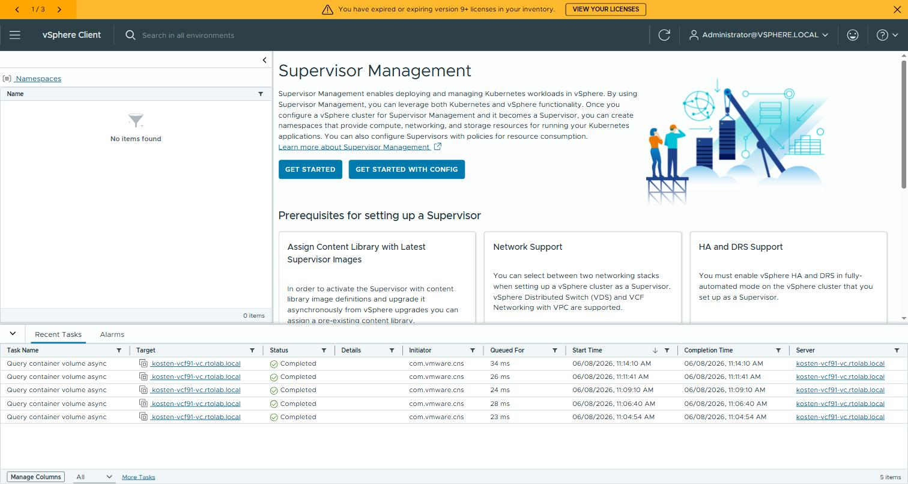 [`00-intro.jpg`](00-intro.jpg) | Supervisor Management 入口（No items found）|
| 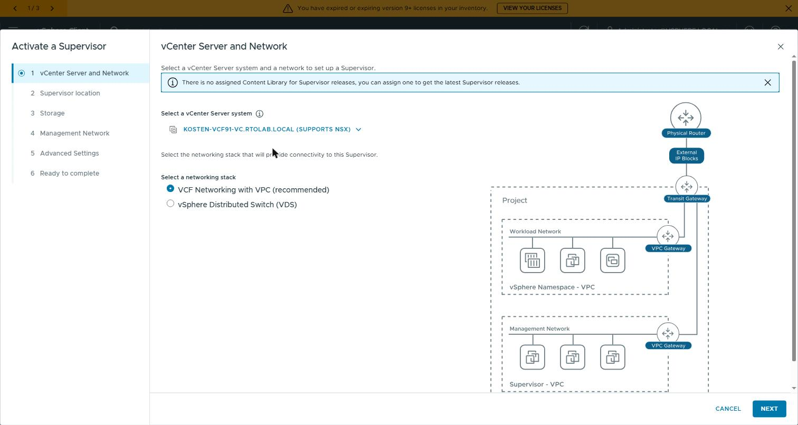 [`01-step1-vcenter-network.jpg`](01-step1-vcenter-network.jpg) | Step1 vCenter + networking stack（只有 VPC / VDS）|
| [`02-step2-cluster-deployment.jpg`](02-step2-cluster-deployment.jpg) | Step2 CLUSTER DEPLOYMENT tab |
| [`03-step2-incompatible.jpg`](03-step2-incompatible.jpg) | Step2 INCOMPATIBLE（未選 datacenter 前空白）|
| [`04-step2-datacenter-expanded.jpg`](04-step2-datacenter-expanded.jpg) | Step2 展開 vcf-m02-dc |
| 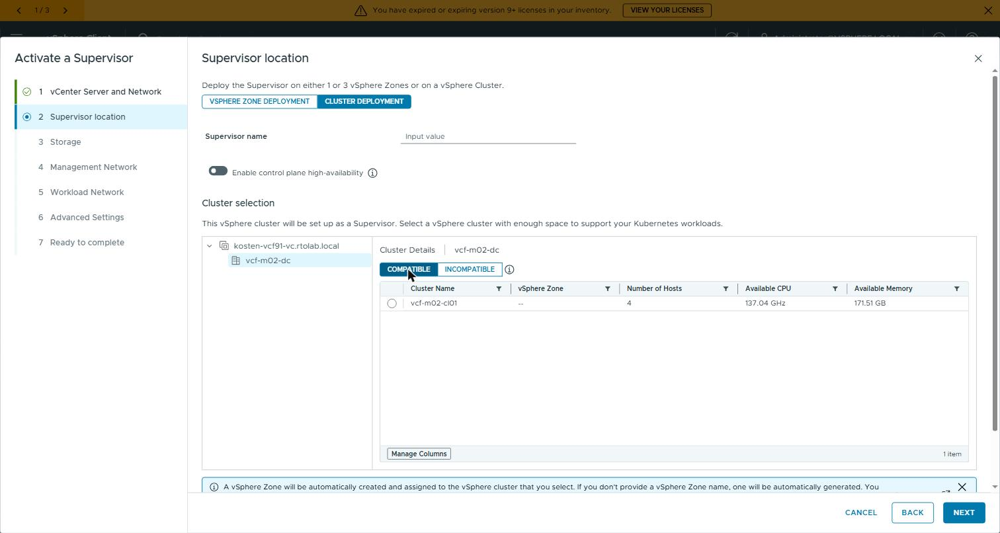 [`05-step2-cluster-compatible.jpg`](05-step2-cluster-compatible.jpg) | Step2 COMPATIBLE → vcf-m02-cl01（4 hosts / 137 GHz / 171 GB）|
| [`06-step2-name-cluster-selected.jpg`](06-step2-name-cluster-selected.jpg) | Step2 填 Supervisor name + 選 cluster |
| 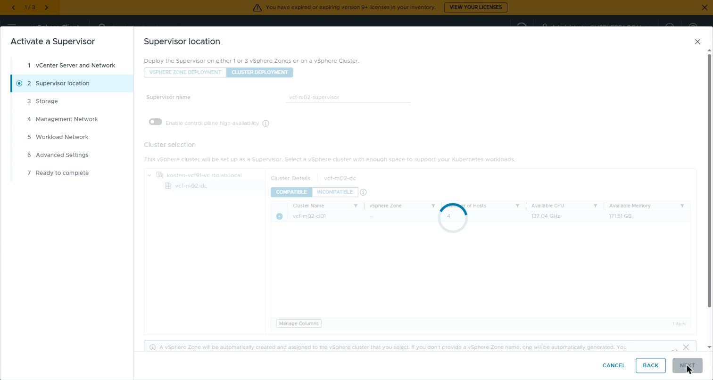 [`07-step3-storage.jpg`](07-step3-storage.jpg) | Step3 Storage（3 個 policy）|

> Step 4–7（Management Network / Workload Network / Advanced / Ready）因 nested vCenter
> renderer 在 Step 3 Storage 的 SPBM policy dropdown 載入時凍結，無法繼續操作 wizard；
> 欄位值以實機部署後從 Supervisor → Configure 頁面確認，文字補完於上方各節。
> （已試 JS fetch/XHR interceptor 繞過 SPBM 載入，vSphere client 不走標準 XHR，無效。）
> 實際部署值見 `common/lab.ps1`：SERVICE_CIDR=172.29.0.0/16、VPC_PRIVATE_CIDR=172.28.0.0/16。

---

# NSX Manager 前置設定截圖（2026-06-08）

Step 1 所建 NSX 資源（IP blocks、VPC Connectivity Profile）的運行狀態截圖。

| 檔 | 對應 | 重點欄位 |
|----|------|----------|
| [`40-nsx-ip-blocks.jpg`](40-nsx-ip-blocks.jpg) | NSX → VPCs → IP Management → IP Address Blocks | **3 個 block**：`vcf-m02-vks-ext-ipblock`（EXTERNAL 192.168.114.128/26）、`vcf-m02-vks-priv-tgw`（PRIVATE 172.30.0.0/16）、系統預設 `default--kube-s...`（PRIVATE 172.28.0.0/16）；全部 Status = Success |
| [`41-nsx-vpc-profiles.jpg`](41-nsx-vpc-profiles.jpg) | NSX → VPCs → Profiles → VPC Connectivity Profile | **vcf-m02-vks-vpc-profile**：Transit Gateway = Default Transit Gateway（DTGW）、External IP Blocks = `vcf-m02-vks-ext-ipblock`、Private TGW IP Blocks = `vcf-m02-vks-priv-tgw`；Status = Success |

---

# Supervisor Configure 設定截圖（2026-06-08）

vCenter → vcf-m02-supervisor → Configure 的完成狀態（已部署後的設定檢視）。

| 檔 | 對應 | 重點欄位 |
|----|------|----------|
| [`43-vc-sup-configure-network-mgmt.jpg`](43-vc-sup-configure-network-mgmt.jpg) | Supervisor → Configure → Network → Management Network | IP Assignment Mode = Static、Network = `vcf-m02-cl01-vds01-pg-mgmt`、**Starting IP = 192.168.114.101**（連續 5 個 .101–.105）、Subnet = 255.255.255.0、Gateway = 192.168.114.254、DNS/NTP = 192.168.114.200、Domain = rtolab.local |
| [`43b-vc-sup-configure-network-workload.jpg`](43b-vc-sup-configure-network-workload.jpg) | Supervisor → Configure → Network → Workload Networks | NSX Project = Default、**VPC Connectivity Profile = vcf-m02-vks-vpc-profile**、External IP Blocks（vcf-m02-vks-ext-ipblock 192.168.114.128/26 Usage 12.5%）、Private TGW IP Blocks（vcf-m02-vks-priv-tgw 172.30.0.0/16 Usage 0.02%）|
| [`44-vc-sup-configure-storage.jpg`](44-vc-sup-configure-storage.jpg) | Supervisor → Configure → Storage | Control Plane Nodes / Ephemeral Disks / Image Cache 三個 policy 全選 **Management Storage Policy - Single Node**（FTT=0，lab 用）|

---

# 實機「完成狀態」截圖（乾淨重 cut，2026-06-08）

Supervisor 已 RUNNING、namespace 已建、VKS cluster 已建（DTGW 路線端到端跑通）後，
直接對 live vCenter 截的乾淨狀態圖（給客戶看）。

| 檔 | 對應 | 重點欄位 |
|----|------|----------|
| 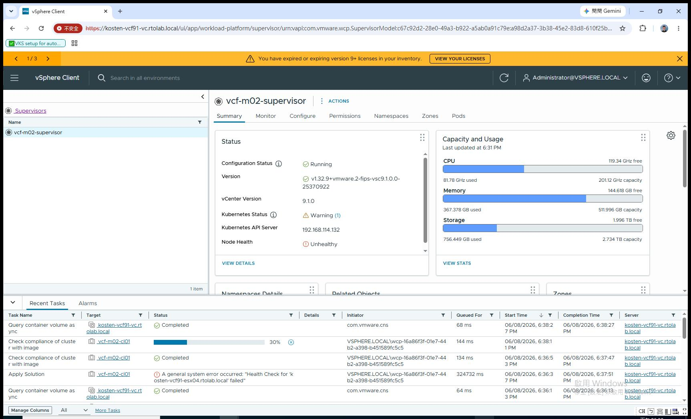 [`30-supervisor-running.jpg`](30-supervisor-running.jpg) | Supervisor → Summary | **Config Status = Running**、Version `v1.32.9+vmware.2-fips-vsc9.1.0.0`、vCenter 9.1.0、**K8s API Server 192.168.114.132**、Capacity（CPU/Mem/Storage）|
| 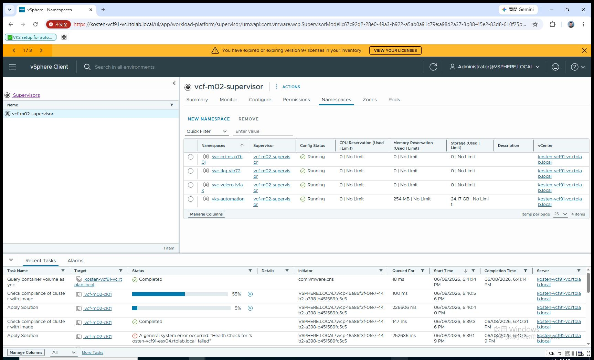 [`32-namespaces-list.jpg`](32-namespaces-list.jpg) | Supervisor → Namespaces | `vks-automation` **Running**（+ 系統 ns svc-cci/svc-tkg/svc-velero）；storage used 反映 VKS cluster |
| 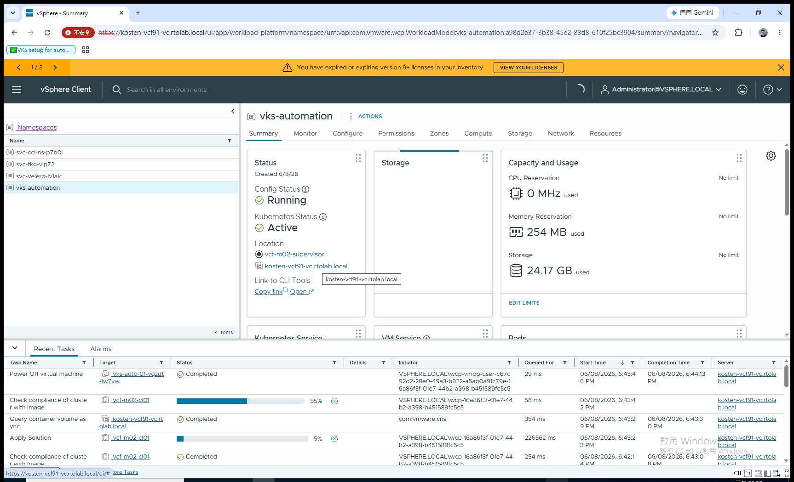 [`33-namespace-vks-automation.jpg`](33-namespace-vks-automation.jpg) | Namespace `vks-automation` → Summary | **Config Status Running / Kubernetes Status Active**、Location vcf-m02-supervisor、Capacity used、下方 Kubernetes Service / VM Service / Pods 區 |
| 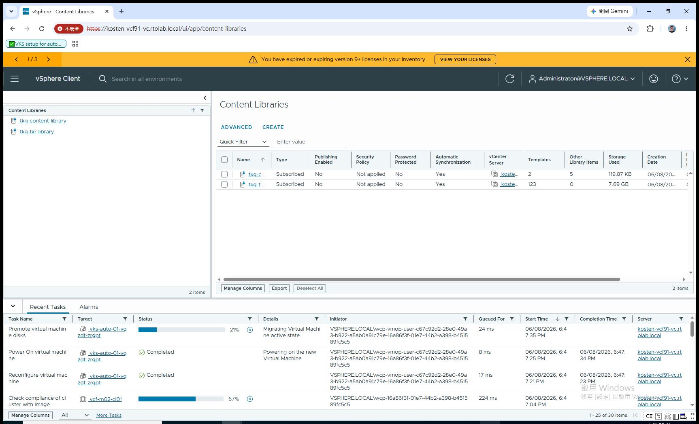 [`34-content-library-list.jpg`](34-content-library-list.jpg) | Content Libraries | **兩個 subscribed library**：`tkg-content-library`（Supervisor image，5 templates）、`tkg-tkr-library`（node image，123 items / 7.69 GB）— **少了 tkr-library 建不出 VKS cluster** |
| 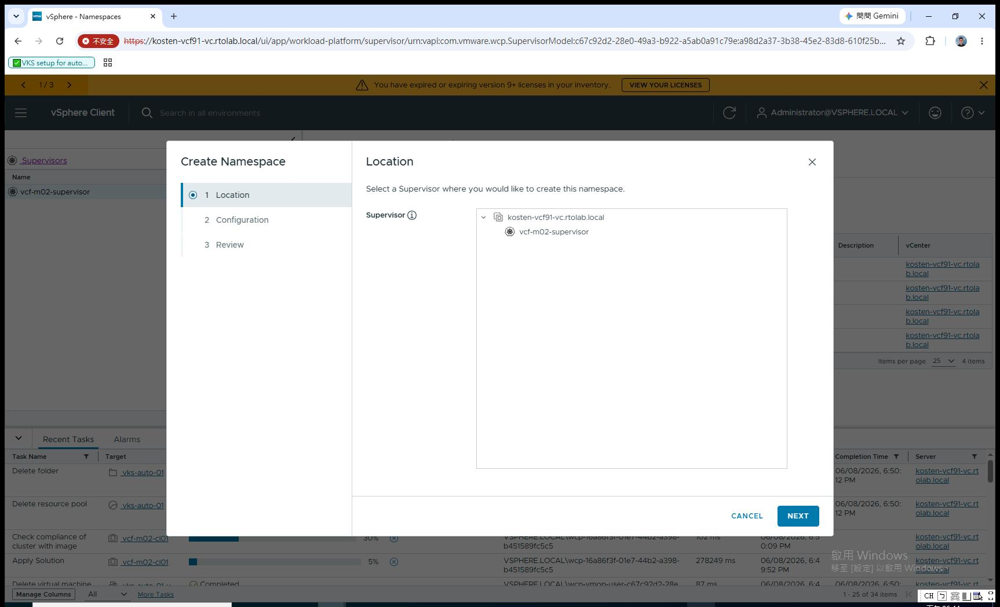 [`35-namespace-create-wizard.jpg`](35-namespace-create-wizard.jpg) | New Namespace wizard | 3 步（Location / Configuration / Review）；Location 選 supervisor `vcf-m02-supervisor` |

| 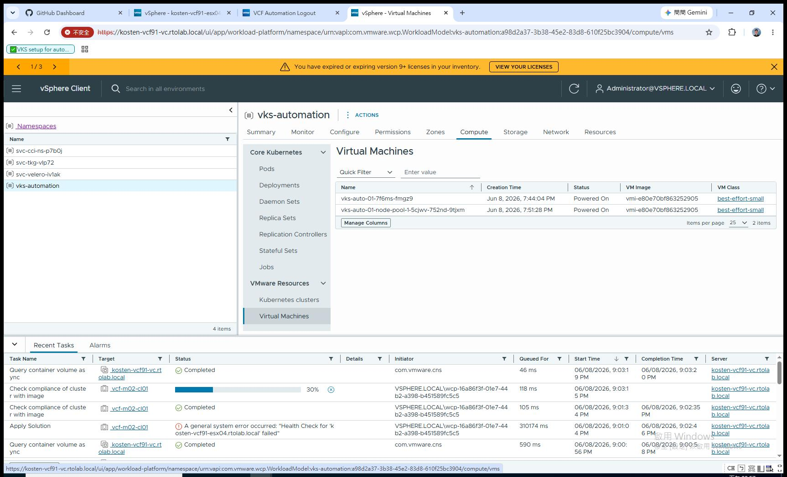 [`36-vks-cluster-vms.jpg`](36-vks-cluster-vms.jpg) | Namespace `vks-automation` → Compute → Virtual Machines | CP VM `vks-auto-01-7f6ms-fmgz9` + Worker `vks-auto-01-node-pool-1-5cjwv-...` 均 **Powered On** |
| 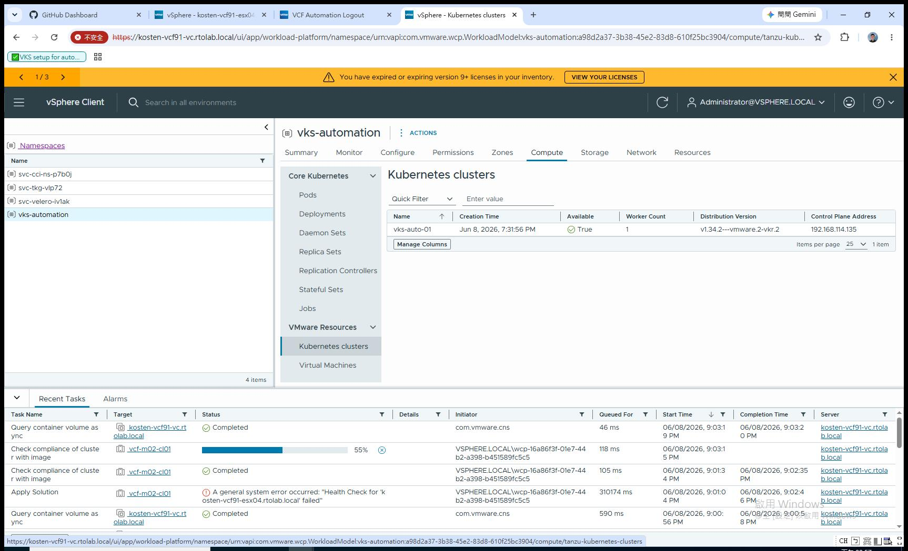 [`37-vks-cluster-running.jpg`](37-vks-cluster-running.jpg) | Namespace → Compute → Kubernetes Clusters | `vks-auto-01` **Available = True**、v1.34.2+vmware.2、Control Plane Address `192.168.114.135` |

> 這批是用自動化直接抓 live vCenter 視窗存到 repo（非手動下載）。
> VNA 叢集相關截圖在 NSX Manager（需另登入），見上方 VNA 章節的 `20-28`。
> Content Library 的「Subscribed + URL / 憑證 Security Alert」見 `10-11`（建立時才會跳憑證信任視窗）。
