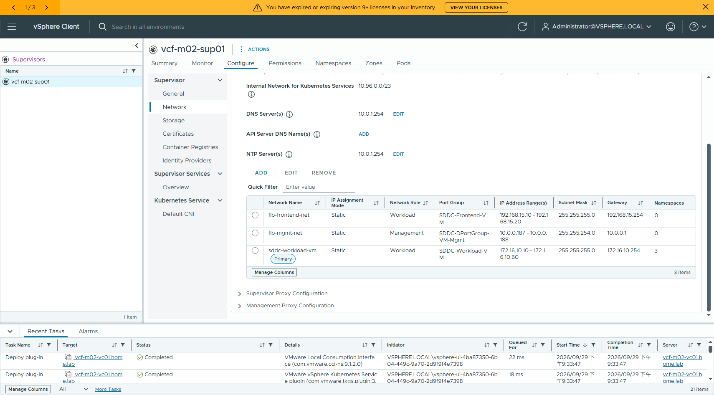

# Supervisor 管理網與工作負載網同 VLAN + 三隻腳負載平衡器

VCF 9.1.1｜vSphere Distributed Switch (VDS) + **Foundation Load Balancer（Two Arm）** 實測
實作日期:2026-09-29

回答兩個設計問題:

1. Supervisor 的 **Management Network 與 Workload Network 可不可以放在同一個 VLAN?**
2. Foundation Load Balancer 能不能跑 **三隻腳（Two Arm）** 架構?

---

## TL;DR

| 問題 | 答案 | 依據 |
|---|:--:|---|
| mgmt 與 workload 同一個 **VLAN** | ✅ | 部署成功;Supervisor CP VM 兩張網卡都落在 VLAN 0 |
| mgmt 與 workload 同一個 **網段** | ❌ | `wcpsvc` 在 FINISH 階段擋下,兩條規則互鎖 |
| 三隻腳（Two Arm）FLB | ✅ | FLB VM 實際 3 張網卡,分屬三個 port group |
| Transit Network 與 mgmt 同 VLAN | ✅ | Transit = Step 5 的 workload network |

> **一句話:同 VLAN 可以,同 subnet 不行。三隻腳需要三個不同的 port group 與三個互不重疊的網段。**

部署耗時 **46 分鐘**（20:49 送出 → 21:35 `RUNNING`,3 台主機、CP HA 關閉）。
Supervisor API Endpoint = `192.168.15.64`（FLB VIP）;Kubernetes `v1.34.9+vmware.1-vsc9.1.1.0-25712839`。

📄 完整手冊(20 頁 / 13 張截圖):[`VCF911-Supervisor-SameVLAN-TwoArm.docx`](VCF911-Supervisor-SameVLAN-TwoArm.docx)

---

## 兩條網路硬性限制

### 規則一:重疊的網路必須「模式一致」（**伺服器端**,按 FINISH 才報）

把 mgmt 與 workload 都放在 VLAN 0 / `10.0.0.0/23`,精靈前七步全過,FINISH 被擋:

```
未知錯誤 - vcenter.wcp.network.static.overlapping.modes.error: flb-mgmt-net, sddc-workload-vm
```

vSphere Client 只顯示 raw message key,沒有翻譯。真正的訊息要到 vCenter 挖：

```bash
# vCenter 先 shell.set --enabled true
strings /usr/lib/vmware-wcp/wcpsvc | grep -ao \
  "Networks %s and %s have overlapping portgroup(s) and/or subnets, but do not have matching modes"
# → Networks %s and %s have overlapping portgroup(s) and/or subnets, but do not have matching modes

grep -ao "vcenter.wcp.network[a-z.]*overlapping[a-z.]*" /usr/lib/vmware-wcp/wcpsvc | sort -u
# → vcenter.wcp.network.dhcp.overlapping.modes.error
# → vcenter.wcp.network.static.overlapping.modes.error
```

只要兩個 Supervisor network 的 **port group 或網段有重疊**,其餘設定必須完全一致。

### 規則二:三隻腳不能共用 port group（**精靈端**,即時顯示）

直覺的繞法是讓 FLB Management 與 workload 共用同一個 port group（這樣就「一致」了）。改下去,Load Balancer 那一步直接跳:

```
Management, Virtual Server, and Transit Networks cannot use the same port group.
```

這句字串**在 `wcpsvc` 裡找不到**（見 [`cli/wcpsvc-strings.txt`](cli/wcpsvc-strings.txt) 第三個 grep 無輸出），是 vSphere Client 端的驗證。

### 兩條規則互鎖

Two Arm 的 Transit Network 就是 Step 5 的 workload network:

- 規則二要求它與 FLB Management **不同 port group**
- 規則一要求 port group 不同時 **網段不可重疊**

→ **workload network 與 FLB management network 不可能共用同一個網段。**

但這兩條規則管的都是 *port group* 與 *網段*,**沒有一條管 VLAN**。在同一個 VLAN 上開兩個 port group、給各自的網段,就通過了。

---

## 本次採用的網路規劃

| 角色 | Port Group | VLAN | 網段 / 範圍 | 閘道 |
|---|---|:--:|---|---|
| Supervisor Management | `SDDC-DPortGroup-VM-Mgmt` | **0** | 10.0.0.182 - 10.0.0.186 /23 | 10.0.0.1 |
| FLB Management | `SDDC-DPortGroup-VM-Mgmt` | **0** | 10.0.0.187 - 10.0.0.188 /23 | 10.0.0.1 |
| FLB Virtual Server | `SDDC-Frontend-VM` | 5 | 192.168.15.10 - .20 /24;VIP .64 - .95 | 192.168.15.254 |
| Workload / Transit | `SDDC-Workload-VM` | **0** | 172.16.10.10 - .60 /24 | 172.16.10.254 |

Supervisor Management 與 Workload **同在 VLAN 0**,但兩個 port group、兩個不重疊網段。
FLB Management 與 Supervisor Management 共用 port group 與網段是允許的（設定完全一致 → 符合規則一）。

### 在同一個 VLAN 上多開一個網段

workload 要跟 mgmt 同 VLAN 又不能同網段,所以這個 VLAN 上必須有第二個閘道:

```
# RouterOS（本 lab;工具 scripts/Invoke-RouterOS.ps1）
/ip/address/add =address=172.16.10.254/24 =interface=ether1 =comment=vks-workload-same-vlan
/ip/dns/set =servers=<upstream-dns> =allow-remote-requests=yes
```

打開 DNS 轉發、把 workload 的 DNS/NTP 都指向 router,就不必在每台服務器上補靜態路由。
管理端（跳板機、vCenter）若要直連 workload 節點除錯,再各自補一條:

```bash
route add 172.16.10.0 mask 255.255.255.0 10.0.1.254 -p    # Windows
ip route add 172.16.10.0/24 via 10.0.1.254                # vCenter / Linux
```

> 實體環境若閘道在交換器或防火牆上,就是在同一個 SVI / VLAN interface 上加 secondary IP。
> 概念一樣:**一個 VLAN、兩個網段、兩個閘道**。

---

## 驗證

### 三隻腳:FLB VM 有 3 張網卡

One Arm 的 FLB VM 只有 2 張（`ethernet-0/1`）。Two Arm 是 3 張：

```bash
govc device.info -json -vm '<path>/flb-vcf-m02-sup01 (1)' 'ethernet-*' | \
  python -c "import sys,json;d=json.load(sys.stdin);[print(x['deviceInfo']['label'],'->',x['backing']['port']['portgroupKey']) for x in d['devices']]"
```

| 網卡 | Port Group | VLAN | 角色 |
|---|---|:--:|---|
| Network adapter 1 | `SDDC-Frontend-VM` | 5 | Virtual Server（192.168.15.10） |
| Network adapter 2 | `SDDC-DPortGroup-VM-Mgmt` | **0** | FLB Management（10.0.0.187） |
| Network adapter 3 | `SDDC-Workload-VM` | **0** | Transit（172.16.10.x） |

### 同 VLAN:CP VM 兩張網卡都在 VLAN 0

```
Network adapter 1    -> dvportgroup-24    (SDDC-DPortGroup-VM-Mgmt, VLAN 0)
Network adapter 2    -> dvportgroup-159   (SDDC-Workload-VM,        VLAN 0)
```

### Supervisor 狀態

```bash
S=$(curl -sk -X POST -u "$VC_USER:$VC_PASS" https://$VC/api/session | tr -d '"')
curl -sk -H "vmware-api-session-id: $S" \
  https://$VC/api/vcenter/namespace-management/supervisors/summaries
```

```json
{ "APIEndpoint": "192.168.15.64", "kubernetes_status": "READY",
  "name": "vcf-m02-sup01", "config_status": "RUNNING" }
```

UI 上的三網路一覽（`Configure → Network → Workload Networks`）：



---

## 部署過程中的暫時性訊息（不用理）

| 訊息 | 說明 |
|---|---|
| `Timed out waiting for LB service update ... will be retried` | 約持續 12 分鐘,會自動重試 |
| `error installing service 'velero...' / 'tkg.vsphere.vmware.com 3.7.0-embedded+v1.36'` | 內建 Supervisor Services 安裝過程,約 2 分鐘後轉 Configuring → Running |

完整時間軸見 [`cli/timeline.txt`](cli/timeline.txt)。

---

## 踩坑速查

| 狀況 | 原因 / 處理 |
|---|---|
| FINISH 報 `vcenter.wcp.network.static.overlapping.modes.error` | 兩個網路網段重疊而其他設定不一致 → workload 換獨立網段 |
| Load Balancer 頁顯示 `cannot use the same port group` | Two Arm 三隻腳指到同一個 port group → 至少三個不同 port group |
| `名稱 XXX 必須符合 RFC-1123` | 切換 port group 時 Network Name 被自動帶成 port group 名稱(含大寫) → 改全小寫 |
| `在指定的範圍內找到保留的 IP 位址` | IP 範圍內有已使用的位址 → 先掃過再填 |
| One Arm vs Two Arm 怎麼選 | One Arm = 2 port group / 2 網段;Two Arm = 3 port group / 3 網段,前後端流量分離 |

---

## 檔案

```
supervisor-samevlan-twoarm/
├── VCF911-Supervisor-SameVLAN-TwoArm.docx   # 20 頁完整手冊(13 張截圖)
├── shots/                                    # 逐步截圖
├── cli/                                      # 驗證用 CLI 原始輸出
│   ├── flb-nic-pg.txt  cp-nic-pg.txt  pg-names.txt
│   ├── sup-summary.json                      # Supervisor RUNNING 狀態
│   ├── wcpsvc-strings.txt                    # 兩條規則的字串佐證
│   └── timeline.txt                          # 部署時間軸
└── scripts/
    ├── gen-sup-samevlan-twoarm-doc.js        # docx 產生器(docx-js)
    ├── watch-sup.sh                          # 輪詢 config_status 到 RUNNING
    └── Invoke-RouterOS.ps1                   # RouterOS API 指令執行器(密碼走 $env:ROS_PASS)
```

> 腳本中的帳密一律走環境變數,repo 內不含任何明文密碼。

相關:[`../airgap-vcf911/`](../airgap-vcf911/) — 同一套環境的 air-gap Supervisor + VKS 部署手冊（One Arm）。
